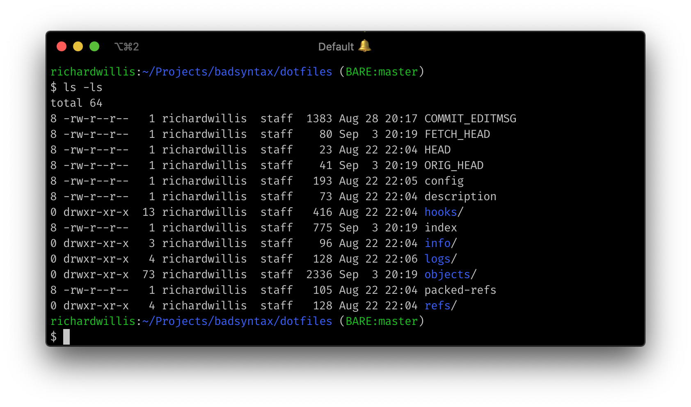

# dotfiles

My dotfiles for macOS.

## Setup

- [Install homebrew](https://brew.sh/)
- [Install nvm](https://github.com/nvm-sh/nvm)
- Install direnv: `brew install direnv`
- Install git-open: `brew install git-open`
- Upgrade bash: `brew install bash bash-completion`

Link the files to your home directory:

```bash
git clone https://github.com/badsyntax/dotfiles.git ~/Projects/badsyntax/dotfiles
ln -sf ~/Projects/badsyntax/dotfiles/{.bashrc,.bash_profile,.gitconfig,.vimrc,.hushlogin} ~
```

## Bash prompt

Basic, pretty, fast.



## vscode settings

See https://github.com/badsyntax/richard-willis-vscode-extension-pack